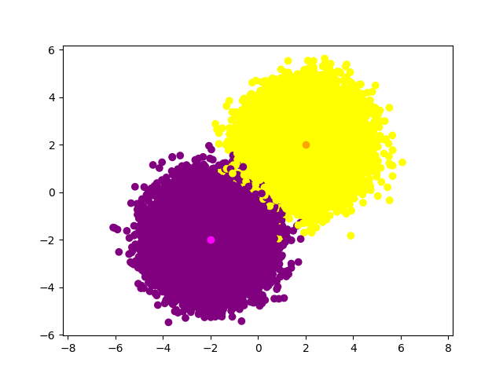
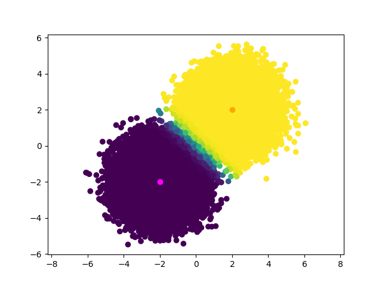
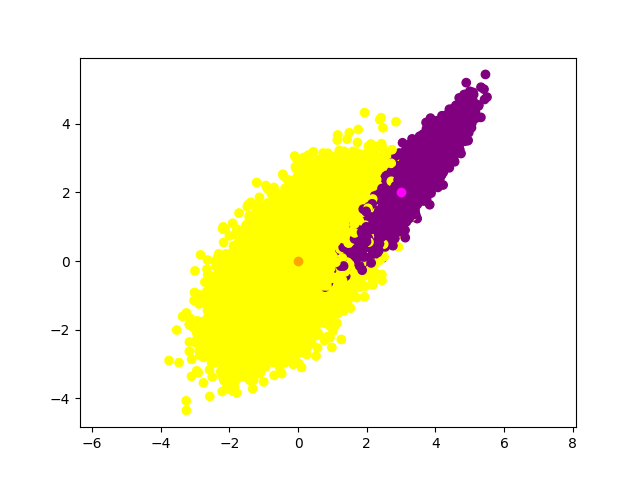
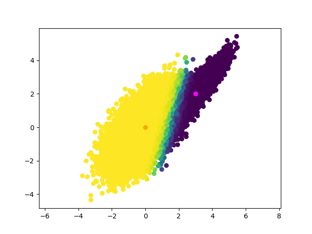
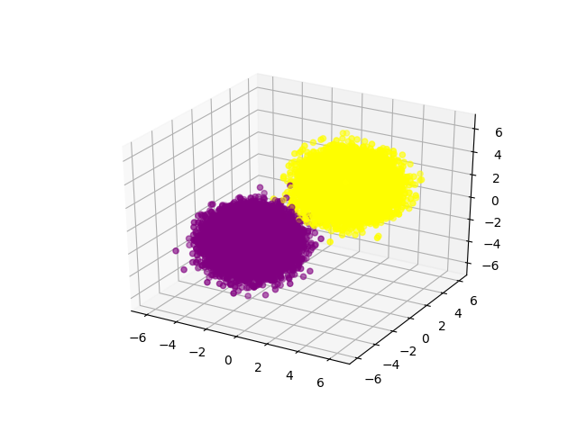
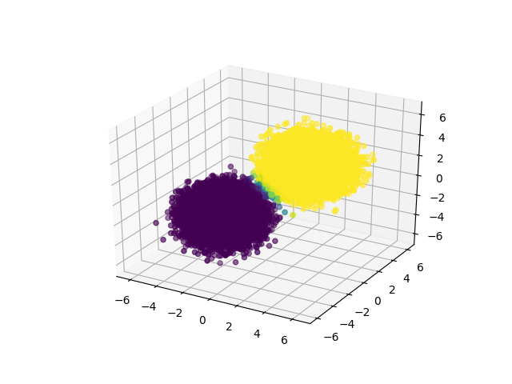
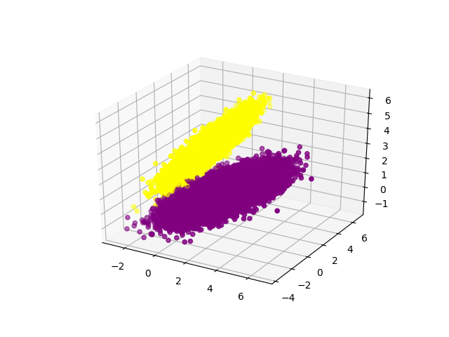
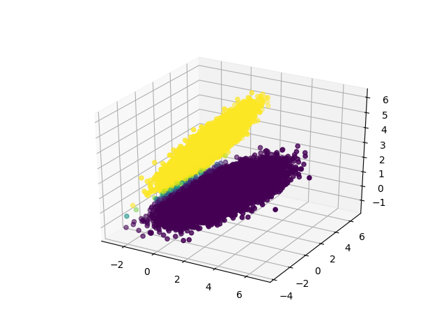

# Logistic Regression

## Description
Implements a logistic regression algorithm using gradient descent.

## Usage
```
./logistic_regresion_test.py [-h] [-N N] [--batch_size B_SIZE]
                                  [--learning_rate L_RATE] [--iterations ITER]
                                  [--3d] [--random]

optional arguments:
  -h, --help            show this help message and exit
  -N N                  the number of samples used
  --batch_size B_SIZE   the batch size used
  --learning_rate L_RATE
                        the fitting learning rate used
  --iterations ITER     the number of iterations used in fitting
  --3d                  test with a 3D set of points
  --random              use random means and covariances
```

## Examples

```
./logistic_regresion_test.py
```

 




```
./logistic_regresion_test.py --random -N=50000 --batch_size=50 --iterations=200
```

 



```
./logistic_regresion_test.py --3d
```

 



```
./logistic_regresion_test.py --3d --random
```

 

